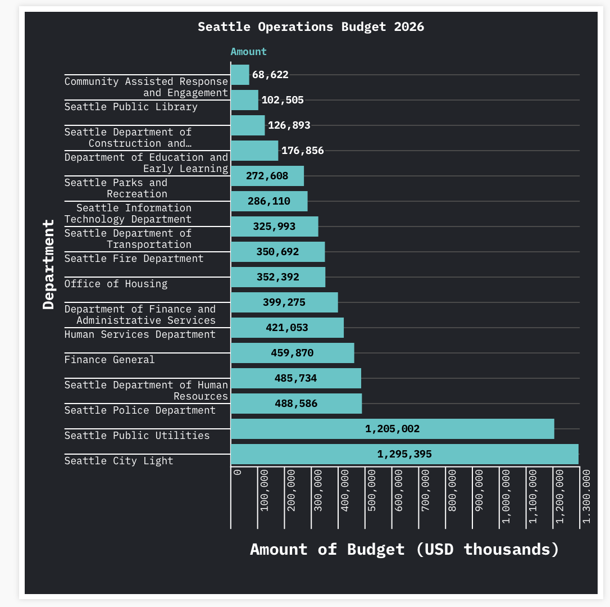

# Seattle Operation Budget for 2026

For my project, I took a look into the operation budget planned for 2026 in Seattle. In the data visualization below, it shows what departments are using the budget and only includes those who are taking up at least 1% of the budget for Seattle in 2026 which was sourced from data.seattle.gov 

[Public Flourish Display](https://public.flourish.studio/visualisation/28548465/)

